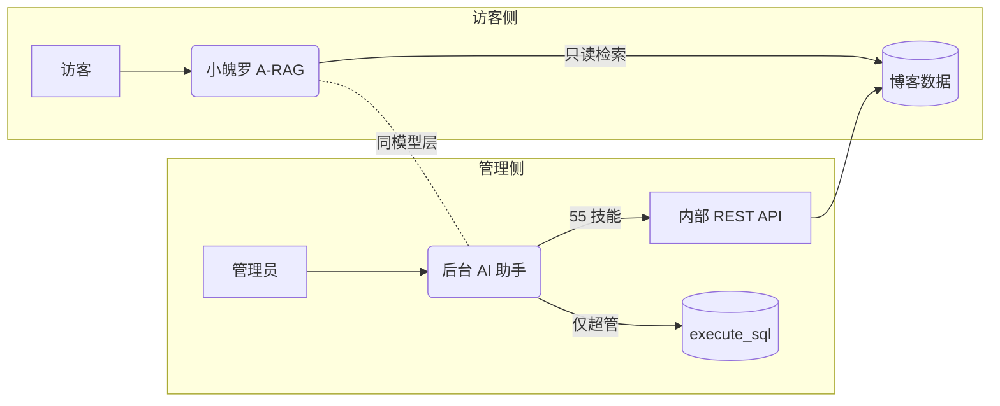
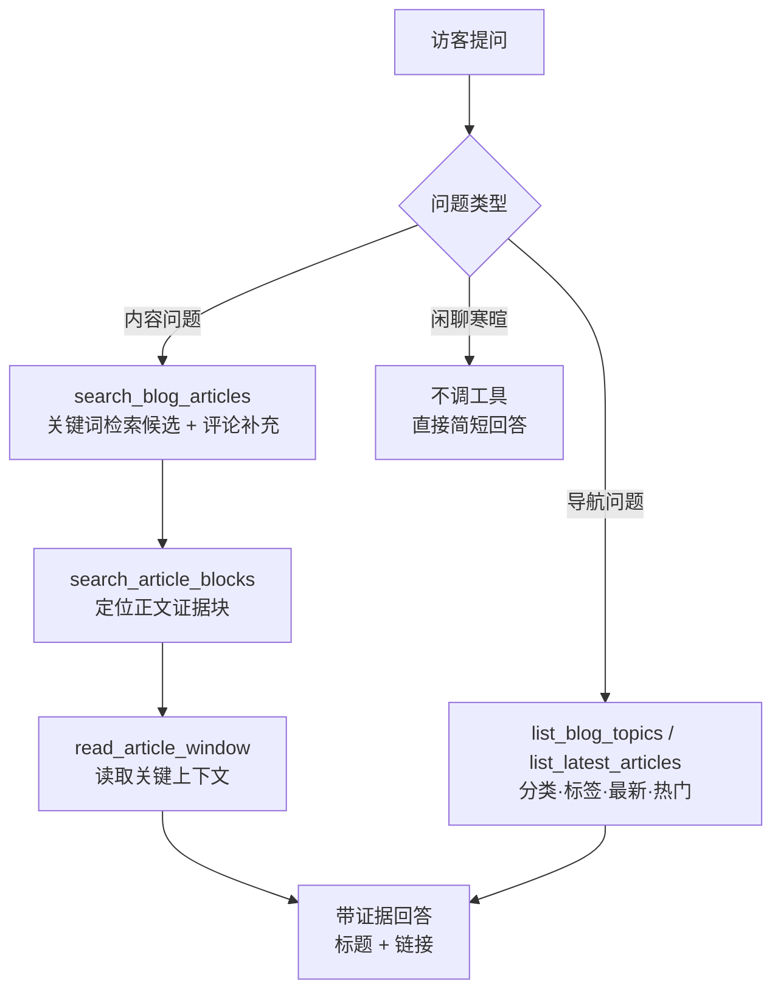
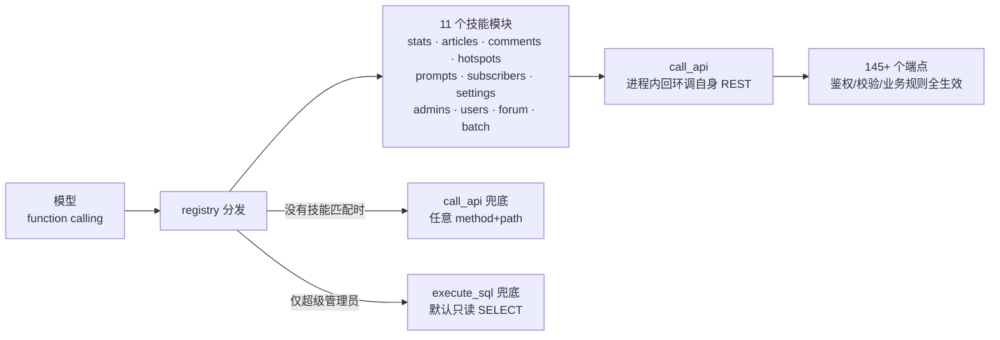

# AI 问答架构

本项目的 AI 能力不是"接了个聊天 API"，而是围绕**两个定位完全不同的智能体**建的：给访客的看板娘**小魄罗**，和给管理员的**后台运维助手**。它们共用同一个 OpenAI 兼容模型层，但工具、权限、交互形态全部独立。

## 总览：一套模型层，两个智能体

| | 🐰 小魄罗（看板娘） | 🤖 后台 AI 助手 |
| --- | --- | --- |
| 面向 | 公开访客（含匿名） | 管理员（Bearer 鉴权） |
| 定位 | 站内问答 / 导览 / 闲聊 | 站点运维：内容、用户、订阅、论坛 |
| 工具 | 9 个，**全部只读** | 55 个技能 + 2 个兜底工具 |
| 界面 | 首页悬浮宠物，气泡对话 | 管理后台工作台（会话、工具卡片、过程流） |
| 接口 | `/api/v1/chat/message/agentic`（唯一通道，匿名限流 6 次/分） | `/api/v1/agent/*`（管理员鉴权） |
| 写权限 | **零** —— 访客不能通过她改动任何内容 | 全权，破坏性操作强制二次确认 |



## 看板娘：无向量 A-RAG

### 为什么不用向量库

个人博客的内容规模（几十篇文章）撑不起一套 embedding + 向量库的复杂度：索引维护、维度选择、检索调参，每一项都比它要解决的问题更贵。**关键词检索 + 结构化定位在这个规模上更快、更准、零依赖**——她像人查资料一样工作：先搜，再定位，再读上下文。

### 检索管线



### 评论也是语料

`search_blog_articles` 的检索结果会合并**站长审核通过过的评论**（检索器内部的 `search_comments`）——只喂 `approved`（审核通过即背书），千禧本人的回复权重加倍。AI 会以「评论区里 XX 补充过」的方式引用，存量评论从「死在文章底部」变成可检索的活语料。

### 九个工具

| 工具 | 类型 | 用途 |
| --- | --- | --- |
| `search_blog_articles` | 检索 | 关键词搜文章（结果自动合并已审核评论的补充命中），返回标题/链接/摘要/相关性得分 |
| `search_article_blocks` | 检索 | 把文章按块索引，定位"哪一段在讲这个" |
| `read_article_window` | 检索 | 读取某文章指定窗口的正文 |
| `read_blog_article` | 检索 | 读全文（含 slug 解析） |
| `search_blog_hotspots` | 检索 | 搜 AI 热点日报 |
| `list_blog_topics` | 导航 | 全部分类/标签及各自文章数 |
| `list_latest_articles` | 导航 | 最新文章（可按分类过滤） |
| `list_popular_articles` | 导览 | 按浏览量/点赞排行的热门文章 |
| `get_site_facts` | 导航 | 站点名/简介/规模/是否开放订阅 |

导航类工具是后期补的——此前访客问「你们都写什么」「最近更新了什么」这类**逛博客**的问题，她只能拿关键词去硬搜，基本答不了。分工写进了系统提示词：导航问题用专门工具，内容问题走检索链。

### 只读是硬边界

看板娘的工具全部是 `SELECT`：代码审查工具（契约自检）会直接扫描工具实现源码，`db.add` / `db.delete` / `db.commit` 出现在看板娘工具里就构建失败。访客再怎么诱导，她也没有可写的东西。

## 后台助手：技能系统

### 架构：HTTP 路由的薄封装

54 个技能不是独立实现，而是**对内部 REST API 的薄封装**——每个技能最终调用的是和前端/管理界面完全相同的端点，意味着权限校验、业务规则、数据校验一个都不会被绕过：



两个兜底工具按危险程度分层：`call_api` 任意管理员可用（仍受业务校验约束）；`execute_sql` 只对超级管理员暴露，且默认只读，写操作需要模型显式声明 `allow_write=true`——系统提示词规定只有管理员明确提出写入需求才允许。

### 批量操作

全站后端没有接受 ID 列表的批量端点，但 AI 最擅长的恰恰是「把这 20 条待审评论一次过」。批量技能在技能层做**循环 + 汇总**：单条失败不中断整批，最后如实回报成功/失败清单（每批上限 50 条），管理员据此决定重试。

### 契约自检：26 个用例守住参数映射

技能是薄封装的代价是**参数名必须和路由签名严丝合缝**——而这类错误不报异常：`GET /articles` 的搜索参数叫 `search`，技能如果传 `keyword=`，FastAPI 会静默忽略，AI 拿到全量列表还以为自己在搜索。这种「不报错、只是结果不对」的 bug 上线过三个，之后我们把契约固化成**零依赖自检**（`backend/scripts/selfcheck_skills.py`），并接进 CI：

| 检查组 | 挡什么 |
| --- | --- |
| 路由存在性 | 技能打的路径必须在 FastAPI 路由表里真实存在 |
| 参数声明 | query 参数名必须被该路由声明，否则等于静默失效 |
| 字段映射 | `keyword→search`、`content→content_md`、`topic_date/analysis_md` 逐条锁死 |
| 必填拦截 | 缺必填必须在**发请求前**被拦下，报错要说清缺什么 |
| 安全底线 | token 不入 body、批量删除必带不可逆提示、看板娘工具只读 |

CI 每次 push 都跑它，26 个用例约 0.05 秒。

### 给模型的返回要裁剪

后端接口是为前端设计的（一次给全），直接塞给模型会撑爆上下文。真实案例：日报元信息接口全量分面计数实测 **78,484 字符**，裁剪到 21,328；看板娘的主题结构工具从 55,790 截到 1,069（**-98%**）。原则：**接口不动（前端还要用），在技能层裁剪**。

## 流式与并发

对话端点在 2026-10-09（十一期）收敛为**单一通道**：旧的非流式 `/chat/message` 与伪流式 `/chat/message/stream` 下线，看板娘的全部对话（含主动搭话气泡）统一走真 SSE：

| 接口 | 形态 | 说明 |
| --- | --- | --- |
| `/chat/message/agentic` | **真 SSE（唯一通道）** | `text/event-stream`，逐事件推送 |
| `/chat/message`（已下线） | — | 收敛前的非流式端点，404 |
| `/chat/message/stream`（已下线） | — | 收敛前的伪流式切片端点，404 |

agentic 端点暴露模型工作过程，前端把每个事件渲染成过程流：

```
reasoning         →  模型的思考片段
tool_start        →  开始调用工具（名称 + 参数）
tool_result       →  工具返回（渲染成可折叠卡片）
text              →  正文增量
evidence_warning  →  软警示：这轮用了检索但答案没引用来源
done              →  结束（缓存命中时带 cached 标记）
error             →  失败原因
```

并发保护：全局 `Semaphore(8)` 挡住并发过载；访客侧按 IP 限流（会话 20/分、消息 6/分、Prompt 实验室 10/分）。

### QA 一级缓存

同一问题免 LLM 免检索直接回放：问题归一化（小写/压空白/去尾标点）后 sha256 **精确命中**才回放——近似命中需要相似度，即需要向量库，明确不做。写入双条件（用过检索工具 且 回答含来源链接）排掉闲聊与"没查到"的兜底话术；**7 天 TTL 自愈**（文章更新后旧答案最多滞留一周）；管理员可经 `/chat/qa-cache` 端点列表/清理（含 AI 助手 call_api 兜底）。实测同题回答从 50 秒降到 0 秒。

### 证据评估门

用了检索工具但回答里一个来源都没有时，端点追加 `evidence_warning` 软警示事件（零额外 LLM 调用的"诚实信号"）——不打断不拦截，只让访客知道这条答案该自行核实。前端在气泡下方渲染黄底提示。

### 与内容的闭环

AI 问答不是孤立功能，它和站内内容形成一条链：文章页的**可追问导读卡**（一句话导读 + 3 个引导问题，站长采纳后才展示）点击问题经浏览器事件唤起看板娘直接追问；她答不透时访客一键把对话上下文**转成「问千禧」论坛帖**（复用游客发帖管线，蜜罐/限流全生效）；站长回复后，后台 AI 助手可以把好问答**整理成署名文章**存草稿——新读者又能带着导读卡来追问。每一环都由真实内容驱动。

## 安全模型

| 边界 | 机制 |
| --- | --- |
| 看板娘零写权限 | 工具全只读 + 契约自检扫源码强制 |
| 后台助手鉴权 | 管理员 Bearer；`execute_sql` 仅超级管理员，默认只读 |
| XSS | 所有 AI 输出渲染**默认禁用原始 HTML**（`allowHtml=false`）并过 `rehype-sanitize` 消毒——这条红线来自一次真实事故：匿名评论里的 `` 曾能在管理员浏览时执行并偷走 localStorage 里的 JWT |
| 越权 | 技能走正式 REST，身份随请求传递，后端权限层全生效 |
| 滥用 | 访客按 IP 限流；批量操作上限 50 条且失败明细如实回报 |

## 相关链接

[功能特性](/features) · [开发历程](/history) · [线上体验（和她聊聊）](https://blog.qianxi7988.me/)
